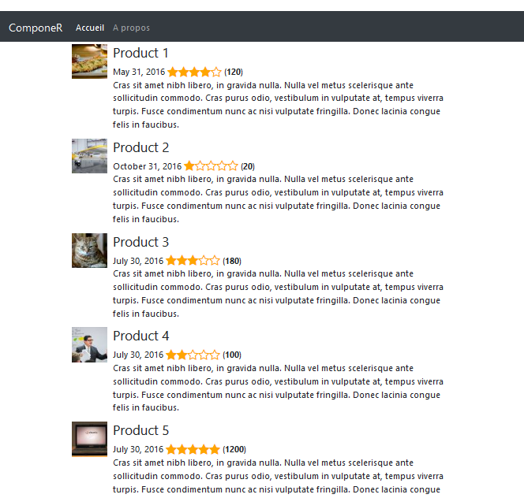
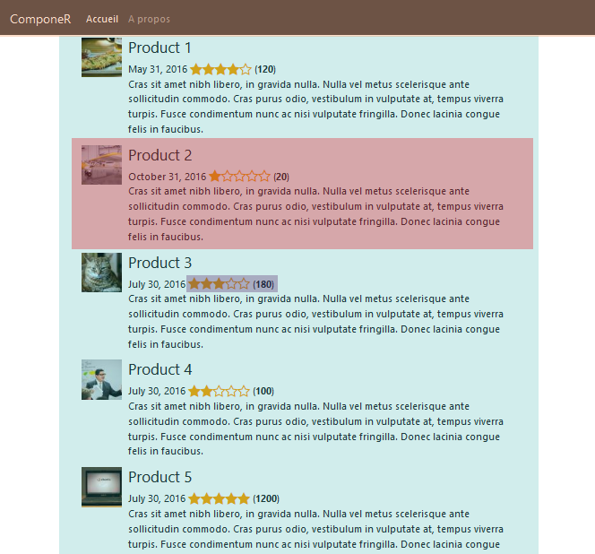
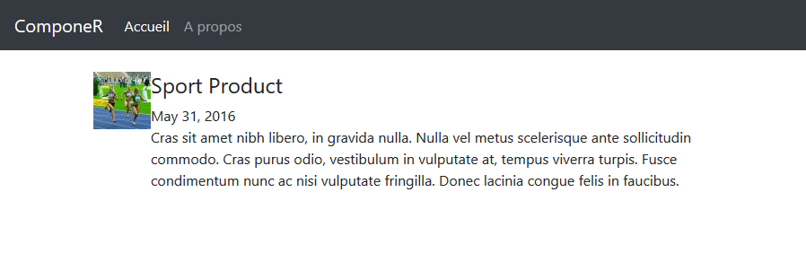

# Lab 1 - Composants Angular 


### Objectifs

- Créer et concevoir un composant
- Faire interagir deux composants
- Installer des librairies tierces
- Utilisation de Angular CLI

### Informations transverses

| Durée      | 30min                            |
| ---------- | -------------------------------- |
| Difficulté | Facile                           |
| Pré-requis | Squelette du Lab 0               |
| Mots-clés  | `component` `bootstrap` `jquery` |

### Ce que nous allons coder

Dans ce Lab, nous allons créer une application qui affiche une liste de produits avec chacun un rating.

### A la fin du Lab

Vous aurez une application qui ressemble à ça :



### Commençons !

##### Installation des librairies

Pour ce Lab, nous aurons besoin de Bootstrap, qui est une librairie graphique trés utilisée sur le Web.

Il y a plusieurs manière d'ajouter Bootstrap à notre projet, on va ajouter Bootstrap avec NPM via la commande suivante :

```
$ npm install bootstrap@4 jquery --save
```

Cette commande s'occupe de deux choses :

* Installation de Bootstrap & jQuery sous `node_modules ` dans notre projet, 
* Mise à jour du fichier `package.json` avec ces deux dépendances.

On doit indiquer dans le fichier `.angular-cli.json` comme suit :

```json
"styles": [
    "styles.css",
    "../node_modules/bootstrap/dist/css/bootstrap.min.css"    
  ],
  "scripts": [
    "../node_modules/jquery/dist/jquery.min.js",
    "../node_modules/bootstrap/dist/js/bootstrap.min.js"
  ],
```

Et voilà, Bootstrap est ajouté !

Avant d'oublier ! on aura aussi besoin d'une librairie d'icônes : *Font-Awesome*, ajoutez-la de la même manière que Bootstrap :

| Nom du module             | `font-awesome`                                        |
| ------------------------- | ----------------------------------------------------- |
| **Chemin du fichier CSS** | `"../node_modules/font-awesome/css/font-awesome.css"` |

##### Conception de notre application

A l'aide de la capture ci-dessous, essayons d'identifier les composants :



On peut remarquer qu'on aura besoin de quatre composants :

1. Un composant **Header**,
2. Un composant **Product** qui affichera des informations sur un produit,
3. Un composant **Rating**,
4. Un composant **Products** qui aura comme fils un ensemble de produits


##### Création du composant Header

Ce module a pour but d'afficher la liste des liens, du coup c'est un module assez simple.

Générer un compsant à l'aide de Angular CLI :

```
$ ng generate component header
  create src/app/header/header.component.html (25 bytes)
  create src/app/header/header.component.spec.ts (628 bytes)
  create src/app/header/header.component.ts (269 bytes)
  create src/app/header/header.component.css (0 bytes)
  update src/app/app.module.ts (398 bytes)
```

Angular CLI se chargera de la génération des différents fichiers ainsi que de l'ajout du nouveau composant au module.

> L'ajout du composant se fait d'une manière automatique quand on utilise Angular CLI, :
>
> ```typescript
> @NgModule({
>   declarations: [
>     AppComponent,
>     HeaderComponent // Compodosant ajouté par le CLI
>   ],
>   imports: [
> ...
> ```

Ouvrez le fichier `header.component.html` (`Ctrl+P` sous VS Code) et ajouter le code suivant :

```html
<nav class="navbar navbar-expand-md navbar-dark bg-dark fixed-top">
  <a class="navbar-brand" href="#">ComponeR</a>
  <button class="navbar-toggler" type="button" data-toggle="collapse" data-target="#navbarsExampleDefault" aria-controls="navbarsExampleDefault" aria-expanded="false" aria-label="Toggle navigation">
    <span class="navbar-toggler-icon"></span>
  </button>

  <div class="collapse navbar-collapse" id="navbarsExampleDefault">
    <ul class="navbar-nav mr-auto">
      <li class="nav-item active">
        <a class="nav-link" href="#">Accueil <span class="sr-only">(current)</span></a>
      </li>
      <li class="nav-item">
        <a class="nav-link" href="#">A propos</a>
      </li>
    </ul>
  </div>
</nav>
```

Et enfin, écraser le contenu du fichier `app.component.html` par `<app-header></app-header>`.

##### Création du composant Product

Ce composant représente le coeur de notre métier, il permet d'afficher les informations sur un produit, on va le générer avec la commande suivante :

```
$ ng g c product
```

Les informations à afficher pour un produit son :

* Image du produit,
* Nom du produit,
* Date de sortie,
* Description.

On va créer une interface qui abritera ces champs à l'aide de la commande :  `ng g i item model`.

Copier l'interface suivante dans le fichier généré :

```typescript
export interface Item {
    imageUrl: string;
    productName: string; 
    releasedDate: string;
    description: string;
}
```

Ensuite, on crée un item dans notre composant **Product** pour l'utiliser au niveau du template :

```typescript
import { Component, OnInit } from '@angular/core';
import { Item } from '../item';

@Component({
  selector: 'app-product',
  templateUrl: './product.component.html',
  styleUrls: ['./product.component.css']
})
export class ProductComponent implements OnInit {

  data:Item = {
    imageUrl: "http://lorempixel.com/64/64/sports/",
    productName: "Sport Product",
    releasedDate: "May 31, 2016",
    description: `Cras sit amet nibh libero, in gravida nulla. Nulla vel metus scelerisque ante 
        sollicitudin commodo. Cras purus odio, vestibulum in vulputate at, tempus viverra turpis. 
        Fusce condimentum nunc ac nisi vulputate fringilla. Donec lacinia congue felis in faucibus.`
  };

  constructor() { }

  ngOnInit() {
  }

}
```

Dans le fichier template correspondant, ajouter le code suivant :

```html
<div class="media">
    <div class="media-left">
        <a href="#">
        
        </a>
    </div>
    <div class="media-body">
        <h4 class="media-heading">
            {{ data.productName }}  
        </h4>                
        {{ data.releasedDate }} 
        <br>                                            
        {{ data.description }}
    </div>
</div>   
```

Mettre à jour le fichier `app.component.html` avec le code suivant :

```html
<app-header></app-header>

<div class="container">
    <div class="row">
        <div class="col">
            <app-product></app-product>
        </div>
    </div>
</div>
```


Après l'intégration des composants Header et  Product dans le composant `AppComponent`, votre application ressemblera à ça :



###### Exercice - Création d'un composant Products

> 1. Corriger le style du produit en ajoutant le code suivant :
>
>    * ```css
>       .media {
>           margin-bottom: 15px;
>       }
>       
>       .media-body {
>           padding-left: 10px;
>       }
>       ```
>
> 2. Créer un nouveau composant **Products**,
>
> 3. Dans le template de ce nouveau composant, afficher un produit,
>
> 4. Rendre le composant Product dynamique en transformant le champ data en paramètre `@Input` ,
>
> 5. Déclarer un tableau d'Items et initialiser-le avec la liste des produits en [annexe](#annexe)  dans le composants Products,
>
> 6. Afficher cette liste de produits en utilisat la directive `*ngFor`,
>
> 7. Nettoyer votre workspace en supprimant les fichier non utilisé (*CSS* et *HTML*).


A cette étape, votre application doit ressembler à ça :


##### Création du module Rating

Maintenant, on a besoin d'afficher des informations supplémentaires sur les produits :

* Un rating (*une note sur 5 sous forme d'étoiles*),
* Le nombre de revues.

Créer un composant `rating` à l'aide du CLI, et ajouter le code suivant :

```typescript
import { Component, OnInit, Input } from '@angular/core';

@Component({
    selector: 'rating',
    template: `
        <i *ngFor="let i of ratings" class="fa fa-lg"
            [class.fa-star-o]="rating < i"
            [class.fa-star]="rating >= i" 
            (click)="onClick(i)"></i>
		(<strong>{{numOfReviews}}</strong>)
	`,
    styles: [`
        .fa {
            color: orange;
        }
    `]                                       
})
export class RatingComponent{
    @Input('rating-value') rating = 0;
    @Input() numOfReviews = 0;
	ratings:number[] = [1, 2, 3, 4, 5];
    
    onClick(ratingValue){
        this.rating = ratingValue;
    }
}
```

###### Exercice - Utiliser le composant Rating

> 1. Ajouter deux nouvelles propriétés à `Item` (*rating et numOfReviews* de type `number`),
>
> 2. Décommenter ces deux propriétés  au niveau du composant **Products**,
>
> 3. Utiliser ce composant dans le module `Product` pour afficher la revue d'un produit.
>
>    * ```html
>       <rating [numOfReviews]="data.numOfReviews" [rating-value]="data.rating"></rating>
>       ```

Voici votre application à la fin de ce Lab :


### Ce qu'il faut retenir

* Pour créer un composant, utiliser la commande `ng generate component <composant>` ou tout simplement `ng g c <composant>`,
* Pour passer des informations à un composant fils, annoter les paramètres avec `@Input` ,
* Externaliser votre modèle sous forme d'interfaces TypeScript : `ng g i <nom> <type>`.

#### Annexe

Liste des produits :

```typescript
this.products = [
      { 
          imageUrl: "http://lorempixel.com/64/64/food/",
          productName: "Product 1",
          releasedDate: "May 31, 2016",
          description: "Cras sit amet nibh libero, in gravida nulla. Nulla vel metus scelerisque ante sollicitudin commodo. Cras purus odio, vestibulum in vulputate at, tempus viverra turpis. Fusce condimentum nunc ac nisi vulputate fringilla. Donec lacinia congue felis in faucibus."
          //,rating: 4,
          //numOfReviews: 120
        },
      { 
          imageUrl: "http://lorempixel.com/64/64/transport/",
          productName: "Product 2",
          releasedDate: "October 31, 2016",
          description: "Cras sit amet nibh libero, in gravida nulla. Nulla vel metus scelerisque ante sollicitudin commodo. Cras purus odio, vestibulum in vulputate at, tempus viverra turpis. Fusce condimentum nunc ac nisi vulputate fringilla. Donec lacinia congue felis in faucibus."
          //,rating: 1,
          //numOfReviews: 20               
      },
      {                 
          imageUrl: "http://lorempixel.com/64/64/cats/",
          productName: "Product 3",
          releasedDate: "July 30, 2016",
          description: "Cras sit amet nibh libero, in gravida nulla. Nulla vel metus scelerisque ante sollicitudin commodo. Cras purus odio, vestibulum in vulputate at, tempus viverra turpis. Fusce condimentum nunc ac nisi vulputate fringilla. Donec lacinia congue felis in faucibus."
          //,rating: 3,
          //numOfReviews: 180   
      },
      {                 
          imageUrl: "http://lorempixel.com/64/64/business/",
          productName: "Product 4",
          releasedDate: "July 30, 2016",
          description: "Cras sit amet nibh libero, in gravida nulla. Nulla vel metus scelerisque ante sollicitudin commodo. Cras purus odio, vestibulum in vulputate at, tempus viverra turpis. Fusce condimentum nunc ac nisi vulputate fringilla. Donec lacinia congue felis in faucibus."
          //,rating: 2,
          //numOfReviews: 100       
      },
      {                 
          imageUrl: "http://lorempixel.com/64/64/technics/",
          productName: "Product 5",
          releasedDate: "July 30, 2016",
          description: "Cras sit amet nibh libero, in gravida nulla. Nulla vel metus scelerisque ante sollicitudin commodo. Cras purus odio, vestibulum in vulputate at, tempus viverra turpis. Fusce condimentum nunc ac nisi vulputate fringilla. Donec lacinia congue felis in faucibus."
          //,rating: 5,
          //numOfReviews: 1200
      }];
```

