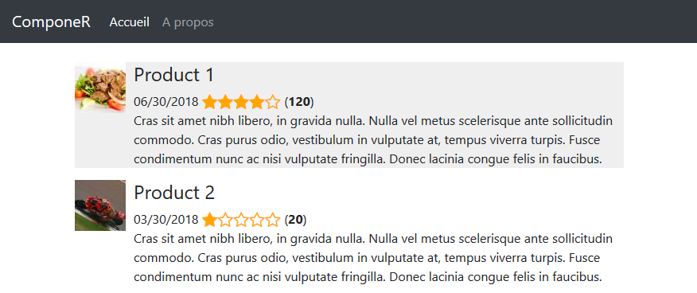
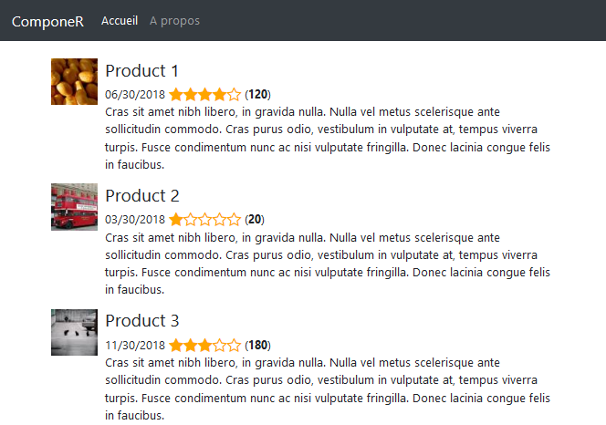
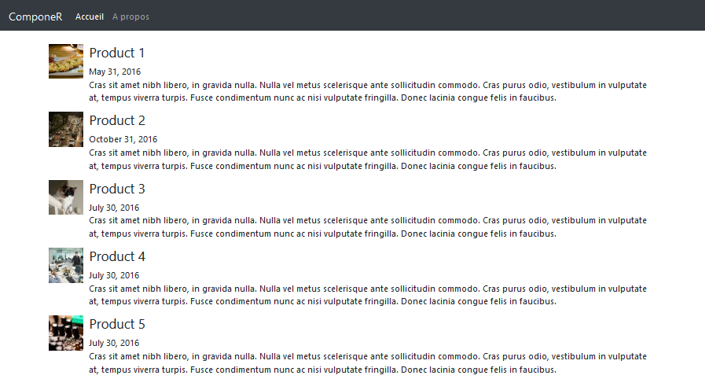

# Lab 2 - Découvrir les pipes et les directives


### Objectifs

- Apprendre à utiliser les pipes,
- Créer une pipe personnalisée,
- Créer et utiliser des directives,

### Informations transverses

| Durée      | min                                   |
| ---------- | ------------------------------------- |
| Difficulté | Facile                                |
| Pré-requis | Squelette du Lab 1 (`components.zip`) |
| Mots-clés  | `pipes` `directives`                  |

### Ce que nous allons coder

Nous allons nous baser sur l'application du Lab 1 et l'enrichir avec des nouvelles fonctionnalités :

* Transformer la date de sortie d'un produit de `string` à `Date` et utiliser la pipe `date`,
* Créer une pipe qui contrôle la taille de la description d'un produit,
* Créer des directives personnalisées.

### A la fin du Lab

Vous aurez quelque chose qui ressemble à ça :



### Commençons !

##### Transformer la date de sortie à Date

La date de sortie du Lab précédent est une chaîne de caractères, dans une application réelle il faut que cette données soit un objet de type date car on peut l'afficher sous plusieurs formes et selon le langage du user.

Pour celà, il faut changer le type de `releasedDate` à `Date` :

```json
{
    ...
	releasedDate: Date;
    ...
}
```

Ensuite, instancier des dates comme suit :

```json
{
    ...
    releasedDate: new Date(2018,5,30),
    ...
}
```

Dans le template du produit, appeler la pipe `date` avec le pattern de votre choix :

```html
{{ data.releasedDate | date:"MM/dd/yyyy" }}
```

Et voilà :



##### Pipe personnalisée

Nous pouvons également écrire nos propres pipes personnalisées. Nous les utilisons de la même manière que les pipes fournies par Angular. Nous allons implémenter une pipe personnalisée qui prend une chaîne et la tronque à une longueur spécifiée. Ceci est utile pour afficher une description de produit tronquée si elle est trop longue comme sur la figure :

HEREX

Créons notre pipe comme toujours avec Angular CLI : `ng g p pipes/truncate`

###### Exercice

> Compléter la pipe `truncate` avec le comportement suivant :
>
> * Si la le nombre de caractères dépasse `n` qui est le paramètre du pipe :
>   * Afficher `n` caractères de la chaînes en entrée suivie de `...`
> * Sinon, afficher la chaîne sans modifications


##### Utiliser des directives

Angular contient par défaut plusieurs directives, par exemple :

```html
<div *ngIf="hero" class="name">{{hero.name}}</div>

<ul>
  <li *ngFor="let hero of heroes">{{hero.name}}</li>
</ul>

<div [ngSwitch]="hero?.emotion">
  <app-happy-hero    *ngSwitchCase="'happy'"    [hero]="hero"></app-happy-hero>
  <app-sad-hero      *ngSwitchCase="'sad'"      [hero]="hero"></app-sad-hero>
  <app-confused-hero *ngSwitchCase="'app-confused'" [hero]="hero"></app-confused-hero>
  <app-unknown-hero  *ngSwitchDefault           [hero]="hero"></app-unknown-hero>
</div>
```

```html
<p [style.display]="'block'">
  Expression sets display to "block".
  This paragraph is visible.
</p>
<p [style.display]="'none'">
  Expression sets display to "none".
  This paragraph is hidden but still in the DOM.
</p>
```


##### Directive personnalisée

La directive que nous allons implémenter a pour objectif de mettre en surbrillance le produit sur lequel pointe le curseur.

D'abord, nous allons créer la directive avec la commande : `ng g d directives/highlight` qui va se charger de l'ajout des différents fichiers et de la mise à jour du fichier `app.module.ts`.

Mettre le code suivant dans `highlight.directive.ts` :

```typescript
import { Directive, ElementRef, HostListener } from '@angular/core';

@Directive({
  selector: '[appHighlight]'
})
export class HighlightDirective {

  constructor(private el: ElementRef) {
  }

  @HostListener('mouseenter') onMouseEnter() {
    this.highlight('#efefef');
  }
  
  @HostListener('mouseleave') onMouseLeave() {
    this.highlight(null);
  }
  
  private highlight(color: string) {
    this.el.nativeElement.style.backgroundColor = color;
  }
}
```

Et voilà :



###### Exercice

> Dans cet exercice vous allez créer une directive `bigtext` qui fait le traitement suivant :
>
> * Si l'élément concerné par la directive est cliqué une première fois, on met la taille du texte à *24px*,
> * Lors du deuxième clic, si l'élément est déjà cliqué on initialise la taille du texte.

### Ce qu'il faut retenir

* Les pipes et les directives permettent de réutiliser le code,
* Elles sont un moyen efficace pour créer du code maintenable et facile à lire,
* Ils permettent de séparer les différentes couches de l'applications.