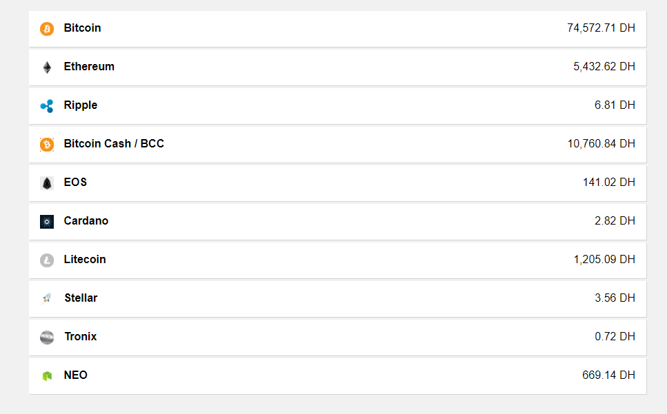
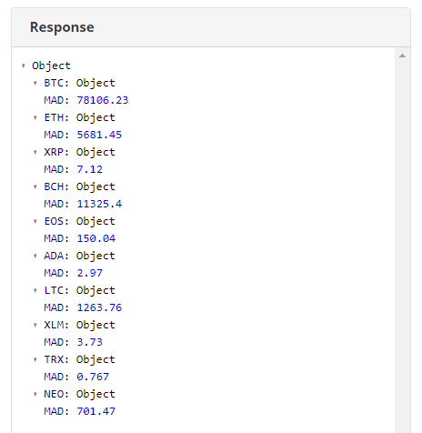

# Lab 3 - Une application qui communique 


### Objectifs

- Utiliser le service HttpClient,
- Récupérer des données à partir d'un WebService Rest,
- Créer des services personnalisés.

### Informations transverses

| Durée      | min                            |
| ---------- | ------------------------------ |
| Difficulté | Moyenne                        |
| Pré-requis | `components` `Angular CLI`     |
| Mots-clés  | `Rest` `HttpClient` `services` |

### A la fin du Lab

Nous allons créer une application qui permet d'afficher la cours des devises electroniques (*Bitcoin, Ethereum*) par rapport au Dirham Marocain :




### Commençons !

Pour ce Lab, nous aurons besoin d'une nouvelle structure pou cela nous allons générer un nouveau projet : `crypto-app`.

##### WebService des crypto-monnaies

Le service que nous allons utiliser permet de récupérer la cours des crypto-monnaies par rapport au Dirham Marocain. Le service est accessible à partir de ce [lien](https://min-api.cryptocompare.com/data/pricemulti?fsyms=BTC,ETH,XRP,BCH,EOS,ADA,LTC,XLM,TRX,NEO&tsyms=MAD) et permet de donner le résultat suivant :




###### Format des données

Les données renvoyées par le service Rest sont comme suit : 

```
{"BTC":{"MAD":83570.04},"ETH":{"MAD":6084.73}}
```

###### Dépendance vers le module HttpClient

Pour pouvoir communiquer avec le service de crypto-monnaie, on doit configurer notre application pour ça en ajoutant le module `HttpClient` au niveau du fichier `app.module.ts`:

```typescript
import { HttpClientModule } from '@angular/common/http';    // Ajouter ceci

...
imports: [
    BrowserModule,
    HttpClientModule                                        // Ajouter ceci
  ],
...
```


###### Création d'un service

Pour bien structurer notre code, nous allons créer un service qui s'occupera de la communication avec le web service en exécutant la commande suivante : `ng generate service data`.

Une fois cette commande exécutée, le fichier `/src/app/data.service.ts` sera créé. Ensuite, le fichier `app.module.ts` devra être modifié comme suit pour pouvoir l'injecter via l'injection de dépendance :

```typescript
...
providers: [DataService],
...
```

Ensuite ajouter le code suivant à votre service :

```typescript
import { Injectable } from '@angular/core';
import { HttpClient } from '@angular/common/http';

@Injectable()
export class DataService {

  readonly baseUrl: string = 'https://min-api.cryptocompare.com/data/';
  readonly currencies: string = 'BTC,ETH,XRP,BCH,EOS,ADA,LTC,XLM,TRX,NEO';

  constructor(private _http: HttpClient) { }

  getPrices() :any {
    return this._http.get(`${this.baseUrl}pricemulti?fsyms=${this.currencies}&tsyms=MAD`);
  }
}
```

La syntaxe suivante permet d'injecter facilement les variables et sans avoir à faire des concaténations :

```typescript
`${this.baseUrl}pricemulti?fsyms=${this.currencies}&tsyms=MAD`
```

##### Création du composant

Das cette étape nous allons modifier notre composant, on utilisera le composant par défaut `AppComponent`.

###### Utilisation du service

Nous allons injecter et utiliser notre service comme suit :

```typescript
import { Component } from '@angular/core';
import { DataService } from './data.service';

@Component({
  selector: 'app-root',
  templateUrl: './app.component.html',
  styleUrls: ['./app.component.css']
})
export class AppComponent {
  objectKeys = Object.keys;
  cryptos: any;

  constructor(private _data: DataService) { }

  ngOnInit() {
    this._data.getPrices()
      .subscribe(data => {
        this.cryptos = data;
      });
  }
}
```

1. Pour injecter un service, on le met comme paramètre du constructeur,
2. `objectKeys` est une propriété définie est tout simplement la fonction JavaScript `Object.keys`. Ceci est nécessaire car la réponse du service Rest est composée d'un objet, par opposition à un tableau.
3. `cryptos` tiendra nos données de crypto-monnaie.

###### Ajout du style

Pour améliorer le design de notre application, ajouter le style suivant :

```css
/* Fichier : app.component.css */
div#crypto-container {
    background:white;
    width: 70%;
    margin: 0 auto 4px auto;
    padding: 1em;
    box-shadow: 1px 1px 0 lightgrey;
}

span.left {
    font-weight: bold;
}

span.right {
    float:right;
}
```

```css
/* Fichier : style.css */
body {
    background: #f1f1f1;
    padding:50px;
    font-family: 'Arial';
}
```


###### Exercice

> Compléter ce Lab pour afficher le logo et le nom complet de la crypto-monnaie, pour cela vous utiliserai le web service suivant [coin/generalinfo](https://min-api.cryptocompare.com/data/coin/generalinfo?fsyms=BTC,MLN,DASH&tsym=MAD) le résultat est comme suit :
>
> ```json
> {
>   "Message": "Success",
>   "Type": 100,
>   "Data": [
>     {
>       "CoinInfo": {
>         "Id": "1182",
>         "Name": "BTC",
>         "FullName": "Bitcoin",	// Utiliser cette données
>         "Internal": "BTC",
>         "ImageUrl": "/media/19633/btc.png", // Utiliser ça pour l'image
>         "Url": "/coins/btc/overview",
>         "Algorithm": "SHA256",
>         "ProofType": "PoW",
>         "NetHashesPerSecond": 28791460506.3233,
>         "BlockNumber": 520755,
>         "BlockTime": 600,
>         "BlockReward": 12.5,
>         "Type": 1,
>         "DocumentType": "Webpagecoinp"
>       },
> ```
>
> 1. Créer une nouvelle fonction  `getCoinInfo` au niveau du service, qui fera appelle au service ci-dessus,
>
> 2. Appeler cette nouvelle fonction dans `ngOnInit` pour initialiser un nouveau champ : `coins`
>
> 3. Utiliser les données récupérées dans votre template, il est important de préciser que :
>   * `Data` est un tableau d'objet,
>   * Chaque élément du tableau `Data` contient plusieurs objets, ce qui nous interesse est l'objet `CoinInfo`,
>
> 4. Utiliser le CSS suivant pour afficher correctement les logos :
>
>    ```css
>    img {
>        width: 20px;
>        margin-right: 10px;
>        vertical-align: middle;
>    }
>    ```
>
>    ​
>
> 4. Voici le résultat final :
>     

### Ce qu'il faut retenir

* Angular permet de communiquer facilement avec des API Rest avec son module HttpClient,

### Pour aller plus loin

* Se documenter sur les intercepteurs,
* Se familiariser avec l'API RxJS.