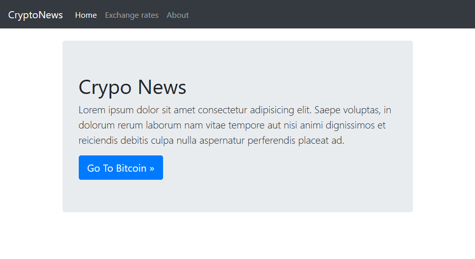
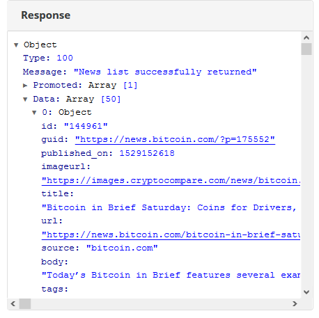
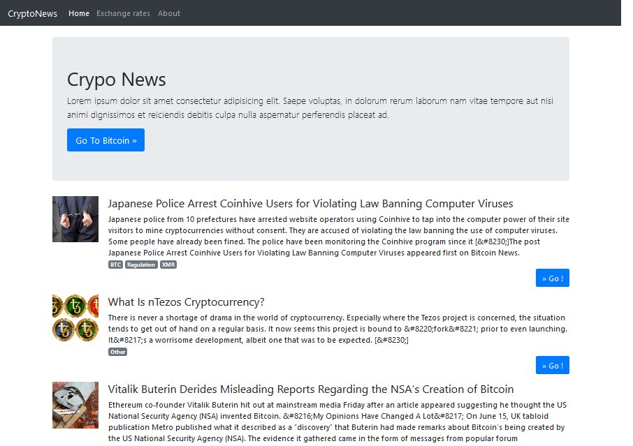
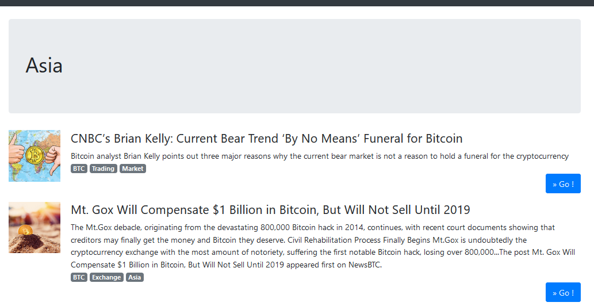
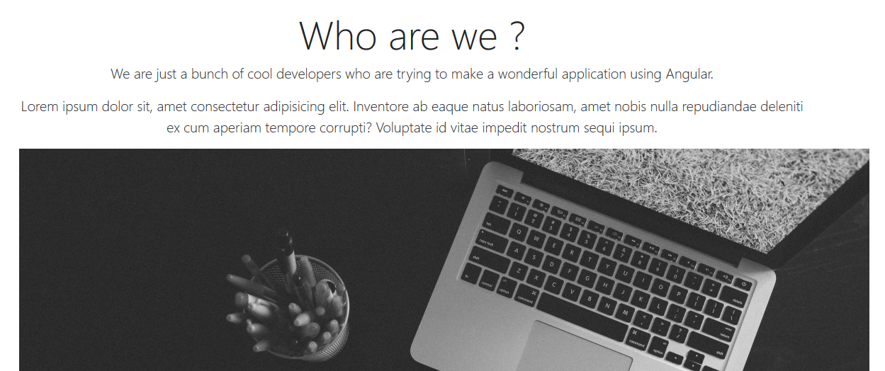
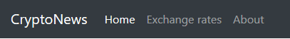

# Lab 4 - Une application qui ressemble à un site  


### Objectifs

- Se familiariser avec les mecanismes de routages offerts par Angular,
- Consommer une API REST.

### Informations transverses

| Durée      | min                   |
| ---------- | --------------------- |
| Difficulté | Moyenne               |
| Pré-requis | Squelette Lab 4       |
| Mots-clés  | `Routing` `bootstrap` |


### A la fin du Lab

Nous allons développer une sorte d'application d'actualités relatives au monde de la crypto-monnaie. Notre application aura plusieurs écrans :

* **Home** : qui affichera des articles généraux,
* **Exchange rates** :  qui affichera les cours de change, (*si vous voulez réutiliser les composants du lab précédent*),
* **About** : Page statique.

### Commençons !

Pour ce Lab, récupérer le projet `routing-starter`, installer et lancer le projet, vous aurez quelque chose qui ressemble à ça :



##### Configuration du routage

Créer un nouveau module qui abritera nos routes :

```
ng g module app-routing
```

Ensuite, ajouter le code suivant dans le module généré :

```typescript
import { NgModule } from '@angular/core';
import { RouterModule, Routes } from '@angular/router';
import { HomeComponent } from '../home/home.component';
import { ExchangeComponent } from '../exchange/exchange.component';
import { AboutComponent } from '../about/about.component';

const routes: Routes = [
  {
    path : '',
    component : HomeComponent
  },
  {
    path : 'exchange',
    component : ExchangeComponent
  },
  {
    path : 'about',
    component : AboutComponent
  }
];

@NgModule({
  imports: [RouterModule.forRoot(routes)],
  exports: [RouterModule]
})
export class AppRoutingModule { }
```

Enfin, importer ce module dans le module `AppModule`.

###### Exercice

> Au niveau du fichier template du composant `header`, modifier les liens pour pointer sur les bons composants.
>
> **NB** utiliser la directive `routerLink` et placer `<router-outlet>` au bon endroit.

##### Page d'accueil

Les news seront récupérées à partir d'un service REST. Le service est accessible depuis ce [lien](https://min-api.cryptocompare.com/data/v2/news/?lang=EN). Son résultat ressemble à ça :



###### Format des données

Ce qui nous interesse dans le resultat de ce service Rest est :

```
Response
	- Data 
        -> title
        -> body
        -> imageurl
        -> categories
        -> url       
```

###### Exercice 1

> 1. Importer le module client http,
>
> 2. Créer un service `news.service` qui récupère les articles à partir de ce service Rest.
>
> 3. Créer un composant article avec le code suivant :
>
>    ```typescript
>    import { Component, OnInit, Input } from '@angular/core';
>    
>    @Component({
>      selector: 'app-article',
>      templateUrl: './article.component.html',
>      styles : [`
>        img {
>            width: 100px;
>            margin-right: 20px;
>        }
>    
>        .badge {
>            margin-right: 5px;
>        }
>      `]
>    })
>    export class ArticleComponent implements OnInit {
>    
>      @Input() article;
>    
>      constructor() { }
>    
>      ngOnInit() {
>      }
>    
>      split(s: string) {
>        return s.split('|').slice(0, 3);
>      }
>    }
>    ```
>    ```html
>    <div class="media">
>      <div class="media-left">
>        <a href="{{article.url}}">
>          
>        </a>
>      </div>
>      <div class="media-body">
>        <h4 class="media-heading">
>          {{ article.title }}
>        </h4>
>        {{ article.body }} <br>
>        <span *ngFor="let category of split(article.categories)" class="badge badge-secondary">{{category}}</span>
>        <p class="text-right">
>          <a href="{{article.url}}" class="btn btn-primary" role="button" target="_blank">» Go !</a>
>        </p>
>      </div>
>    </div>
>    ```
>
> 4. Appeler le service `news.service` dans le composant `home`,
>
> 5. Utiliser ensuite le composant `article` au niveau du composant `home`.


A cet étape vous devez avoir ça :




##### Page de l'actualité par catégorie

Le service REST de récupération des news a un paramètre `categories`, nous allons créer une nouvelle page qui affiche l'actualité par catégorie. Au moment du clic sur une catégorie, l'utilisateur sera redirigé vers l'actualité relative à cette catégorie.

> Exemple d'appel du service REST avec une catégorie : https://min-api.cryptocompare.com/data/v2/news/?lang=EN&categories=Trading

Pour cela créer un nouveau composant `categorie`, et ajouter le dans le module de routage avec l'url `category/:param`.



##### Page About

Il s'agit d'une page statique, vous avez la liberté d'ajouter ce que vous voulez. Par exemple :



##### Correction du header

Si vous l'avez remarqué, si on clique sur un lien au niveau du header, le header ne reflète pas la route choisie :



Dans la majorité des cas, pour mettre en surbrillance une URL en se basant sur la route, on utilise la directive `routerLinkActive` :

```html
<nav>
    <a routerLink="/dashboard" routerLinkActive="active">Dashboard</a>
    <a routerLink="/profil" routerLinkActive="active">Profil</a>
</nav>
```

###### Exercice

> Avec Bootstrap, la barre de navigation ne se base pas seulement sur des liens mais aussi sur des listes.
>
> Dans notre cas, c'est la balise `<li>` qui doit recevoir la classe `active`. 
>
> * Modifier le code pour afficher correctement la barre de navigation.

### Ce qu'il faut retenir

* Les routes sont essentielles pour la construction d'application de type SPA,
* Angular permet de facilement déclarer et d'utiliser les routes.