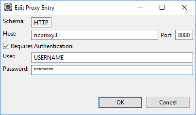

# Eclipse behind a corporate proxy

If you're working in a big company, chances are that you are behind a corporate proxy and it can become very annoying because they tend to limit developement tools. As a Java developer, I use Eclipse as my default IDE.

## The simplest way

Go to `Preferences » General » Network Connections`, then in `Active Provider` choose **Manual**.

Then enter your proxy address, your port and your username and password.



## The hardest way

If you're on Windows and you don't have an explicit username/password couple, then it must be an NTLM proxy, in this case choose **Direct** in `Active Provider` then open your `eclipse.ini` file (*configuration file that you can find in your eclipse directory*). And add this line :

```
-vmargs
Dorg.eclipse.ecf.provider.filetransfer.excludeContributors=org.eclipse.ecf.provider.filetransfer.httpclient4
```

Restart Eclipse and evertyhing should be working like a charm.