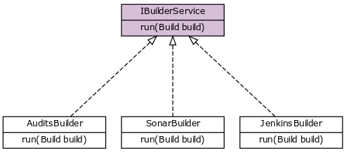

# Inject all implementations using Spring

To be honest, Spring never ceases to amaze me especially with those small features that make your life easier.

## The problem

I was working on project where I have different Spring beans that implement the same interface. Here is the inheritance tree :



I wanted to inject the whole list into a service so if I create a new builder it'll be picked automatically :

```java
private List<IBuilderService> builders;
```

## The solution

There is the wild solution of creating everything manually and  injecting it by name. But there is the clever *not-so-obvious* *out-of-the-box* solution :smile::

```java
@Autowired
private List<IBuilderService> builders;

// ...
for (IBuilderService builder: builders) {
    builder.run(build);
}
```

