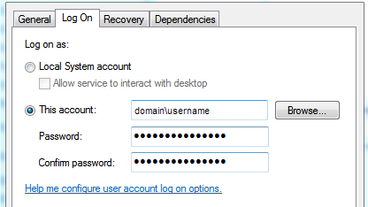

# MS SQL Server Integrated Authentication with Tomcat

In this tutorial I'll show you how I configured Tomcat with Windows integrated authentication rather than SQL Server authentication.

Usually, we connect to databases using a login and a password thus we have a data source that looks like this :

```xml
<Resource auth="Container" driverClassName="com.microsoft.sqlserver.jdbc.SQLServerDriver" 
	maxActive="20" maxIdle="10" maxWait="-1" name="jdbc/MyLocalDB" 			
    type="javax.sql.DataSource" url="jdbc:sqlserver://{server};database={database};user={user};password={password}"/>
```

> This is declared in the `context.xml` as we use it as a JNDI resource.

## Configuring the JDBC driver

In general, if you use Apache Maven or Gradle you'll use a dependency that looks like :

```xml
<dependency>
	<groupId>com.microsoft.sqlserver</groupId
	<artifactId>sqljdbc4</artifactId>
	<version>4.0</version>
</dependency>
```

Otherwise, you can download it [here](https://www.microsoft.com/en-us/download/details.aspx?id=54670), in this case put the Jar in `${TOMCAT_FOLDER}\lib`.

Additionally, you'll have to add a `DLL` file to your system :

1. Download [this](https://www.microsoft.com/en-us/download/details.aspx?id=54670) in case you didn't,
2. Extract the contents to a temporary folder,
3. Navigate to the `\sqljdbc_4.1\enu\auth\` folder in the temporary folder and locate the correct `sqljdbc_auth.dll` file for your system,
4. Copy the `sqljdbc_auth.dll` file into the following location: `C:\Windows\System32`

::: tip
It's better to use the Jar that goes with the DLL to avoid weird errors.
:::

## Add Windows log-on credentials to the Tomcat service

You must add your Windows authentication credentials to the Apache Tomcat service so that they can be passed to SQL Server :

1. Press the `Win+R` keys on your keyboard, to open the *Run* window. Then, type `services.msc` and hit Enter or press *OK*,

2. In the **Services** dialog, right click your **Apache Tomcat** service and go to **Properties**,

3. On the **Log On** tab, click **This account**, then enter the Windows domain/user name and password that is required by SQL Server,

4. Click **OK** to save,

5. Restart your service.

   

## Modify your Data source

Modify your connection string as follows by adding `integratedSecurity=true` in the end as follows :

- Using a port number:
  `jdbc:sqlserver://hostname:port; databaseName=testdb;integratedSecurity=true;`
- For a named instance of SQL Server:
  `jdbc:sqlserver://localhost; instanceName=instance1;integratedSecurity=true;`


::: danger WARNING
This only works in Windows. For other systems, use the usual authentication mode.
:::