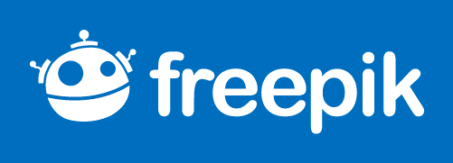

# Icons Web Sites

Sometimes it can be a bit of a headache to find high quality icons. No one can deny that nice icons and illustrations adds a professionnal touch to any kind of project.

In this article, I present you some of the websites that I use very often :

## 1. Freepik

Freepik is a huge resource with a lot more than just icons. You’ll certainly find plenty of beautiful icons here and, as the name suggests, for free. Freepik does require attribution for each resource.

## 2. Flaticon

Boosting the largest database of free vector icons, Flat Icon is brought to you by the same people who created Freepik. What makes Flat Icon unique is that you can convert icons into a downloadable font. Choosing and saving icons to your library is super easy. Attribution is required.

## 3. Iconarchive

Iconarchive offers a lot of icons that you can choose from. It's very rare that you do not find what you need in this platform. Be it a presentation, a website or a document you'll find icons that suit your needs.

