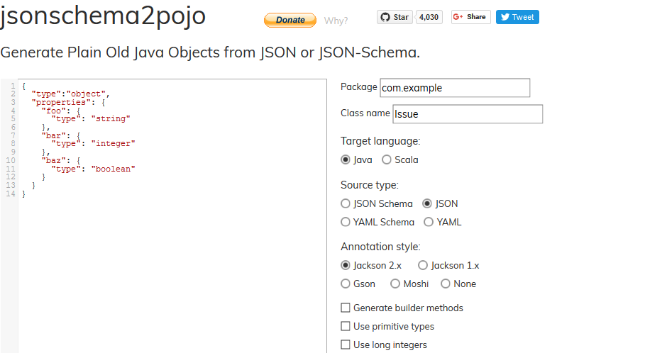

# JSON to Java

In this tutorial, I'll talk about a very interesting and helpful website it's called *jsonschema2pojo*.

The main objective of this website is to convert Json to Java, it takes many source types but to me the most interesting one is **JSON**.




## The problem

Let's take this scenario :

> You need to write Java code that consumes a REST WebService that produces JSON data.
>
> How can we do it using *jsonschema2pojo*


## The solution

### JSON sample

First, run your WebService in a browser or a REST client so you can get a result sample.

```json
{
   "name":"John",
   "age":30,
   "cars":{
      "car1":"Ford",
      "car2":"BMW",
      "car3":"Fiat"
   }
}
```

### Convert to Java

Go to *jsonschema2pojo*, paste your JSON then modify the default configuration :

* Package
* Class Name
* The Annotation Style : use Jackson 2.x
* The rest of the configuration is straightforward.

### Generate

Finally, click on **Zip** to generate a Zip containing the generated Java classes.


